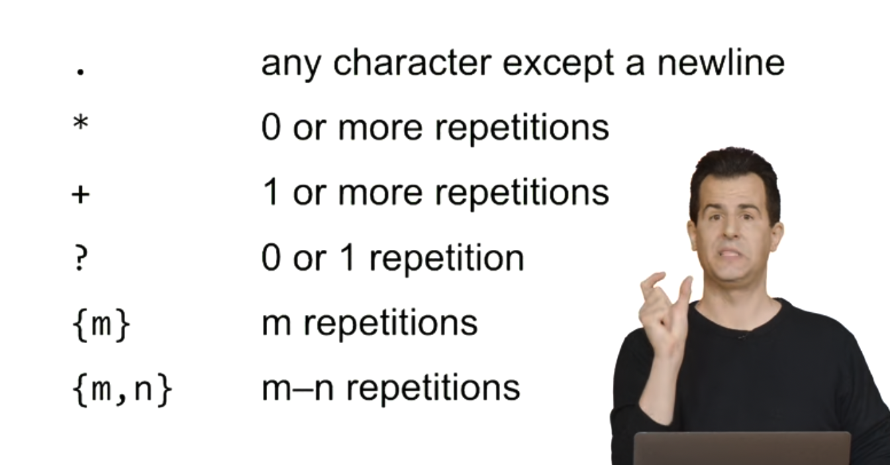

## string 

```python
print(f"Hello,{name}! ") // format string
```

### string function

https://docs.python.org/3/library/functions.html

```python
name = name.strip()
name = name.capitalize()
name = name.title()
name = name.strip() .title()
name = input("what is your name?").strip().title()
```

```python
name = input("What is your name?").strip().title()
first,last=name.split(" ")
print(f"hello,{first}")
```

### Int float

```python
round(num[,ndigits])
```

```python
print(f"{z:,}") #1,000 for big integers
print(f"{z:.2f}") #for float
```

### Bool

```python
return True if n%2 == 0 else False
return n % 2 == 0
```

### Match

```python
name = input("What's your name?")
match name:
  case "Harry" | "Hermione" | "Ron":
    print(Gryffindor)
  case "Draco":
    print("Slytherin")
  case _:
    print("Who?")
```

### Loop

```python
for student in students:
  print(student)
```

```python
print("?" * width)
```

### Dict

```python
students = {"Harry":"Gryffindor","Ron":"Gryffindor",}
print(students["Harry"])
for student in students :
  print(student,students[student],sep=",")
```

```python
students = [
	{"name":"Hermione","house":"Gryffindor","patronous":"Otter"}
  {"name":"Harry","house":"Gryffindor","patronous":"Stag" }
  {"name":"ROn","house":"Gryffindor","patronous":"Jack Russell Terrior"}
  {"name":"Draco","house":"Slytherin","patronous":None}
]
for student in students:
  print(student["name"],student["house"],student["patronous"],sep=", ")
```

### Exception

```python
try : 
  x = int(input("What is x?"))
  print(f"x is {x}")
except ValueError :
  print ("x is not an integer")
print(f"x is {x}")
# Note:如果 x处有Error 那么其实x并没有被赋值，那么在try except之外，其实x没有被赋值
# use else
try : 
  x = int(input("What is x?"))
except ValueError :
  print ("x is not an integer")
else:
  print(f"x is {x}")
```

```python
def main():
  x = get_int("What is x?")
  print(f"x is {x}")
def get_int(prompt):
  while True:
    try : 
  		return int(input("prompt"))
	  except ValueError :
  	  #print("x is not an integer")
      pass
```

### random

```python
random.randint(1,10)
random.shfful(x)
```

### command-line-argument

```python
import sys
if len(sys.argv)<2:
  print("Too Few arguments")
else:
  print("Hello,My name is",sys.argv[1])
# python a.py David
# python a.py "David Melon"
```

```python
import sys
if len(sys.argv)<2:
  sys.exit("Too Few arguments")
print("Hello,My name is",sys.argv[1])
```

#### Slices

```python
for arg in sys.argv[1:-1]: 
```

### APIS Requests JSON

```python
import requests
import sys
if len(sys.argv)!=2:
  sys.exit()
response = requests.get("https://itunes.apple.com/search?entity=ong&limit=50&term=" + sys.argv[1])
#print(reponse.json())
import json
print (json.dump(reponse.json(),indent=2))
o = reponse.json
for result in o["results"]:
  print(result["trackname "])
```

```python
if __name__ == '__main__':
```

### Unit Tests

#### packages

* `__init__.py`

  `pytest test` where test is a folder

### I/O

```python
name = input("What's your name?")
file = open("name.txt","w")	
# file = open("name.txt","a") for append
file.write(f"{name}\n")
file.close( )
```

```python
with open("name.txt","a") as f:
  f.write(f"{name}\n")
with open("name.txt","r") as f:
  lines = f.readlines()
for line in lines:
  print("hello",line,end="")
  #print("hello",line.rstrip())
  
# more compact way
with open("name.txt","r") as f:
  for line in f:
    print("hello",line.rstrip())
# sort
names[]
with open("name.txt","r") as f:
  for line in f:
    names.append(line.rstrip())
for name in sorted(names):
  print(f"hello,{name}")
# or
with open("name.txt","r") as f:
  for line in sorted(f):
    print("hello",line.rstrip())
```

```python
students = []
with open("name.txt","r") as f:
  for line in f:
    name,house = line.rstrip().split(",")
    student = {"name":name,"house:"house}
    #student["name"]=name
    #student["house"]=house 
    students.append(student)
def get_name(student):
   return student["name"]
def get_house(student):
   return student["house"]
for student in sorted(students,key=get_name,reverse = True):
  print(f"{student['name']} is in {student['house']}")
for student in sorted(students,key=get_house,reverse = True):
  print(f"{student['name']} is in {student['house']}")

#lambda
for student in sorted(students,key=lambda student:student["name"],reverse = True):
  print(f"{student['name']} is in {student['house']}")
```

#### CSV Libraries

##### CSV Reader

```python
import csv
students = []
with open("students.csv")as file:
  reader = csv.reader(file)
  for name,home in reader :
    students.append({"name":name,"home":reader})
for student in sorted(students,key=lambda student:student["name"],reverse = True):
  print(f"{student['name']} is in {student['house']}")
```

#### CSV DictReader

```python
import csv
students = []
with open("students.csv")as file:
  reader = csv.Dictreader(file)
  for row in reader :
    #students.append({"name":row["name"],"home":row["home"]})
    students.append(row)
for student in sorted(students,key=lambda student:student["name"],reverse = True):
  print(f"{student['name']} is in {student['house']}")
```

##### CSV Writer

```python
import csv
name = input("Name: ")
home = input("Home: ")
with open("students.csv","a") as file:
  writer = csv.writer(file)
  writer.writerow([name,home])
```

##### CSV DictWriter

```python
import csv
name = input("Name: ")
home = input("Home: ")
with open("students.csv","a") as file:
  writer = csv.DictWriter(file,fieldnames = ["name","home"])
  writer.writerow({"name":name,"home":home})
```

### Images , PIL Libraries

```python
import sys
from PIL import Image
images = []
for arg in sys.argv[1:]:
  image = image.open(arg)
  images.append(image)
images[0].save(
  "coustumes.gif",
  save_all=True,
  append_image[images[1]],
  duration = 200,
  loop=0
)
```

## Regular Expressions

```python
email = input("What's your email?").strip()
username,domain =. email.split("@")
if username and domain.endswith(".edu"):
  print("Valid")
else:
  print("Invalid")
```

### Re



```python
#re.search(pattern,string,flags = 0)
import re
email = input("What's your email?").strip()
if re.search(".+@.+",email): #..*@..*
  print("Valid")
else:
  print("Invalid")  
```

## Object-Oriented Programming

### Tuple

```python
def main():
  student = get_student()
  '''if student[0] == "Padma"
  	student[1]= "Ravenclaw" '''
  # if return a tuple this will cause error because tuple cannot be changed
  #we can alternatively use return [name,house]
   print(f"{student[0] from {student[1]}}")
def get_student():
  name = input("Name: ")
  house = input("House: ")
	return (name,house ) #return a tuple
```

### Dictionaries

```python
def main():
  student = get_student()
  print(f"{student['name'] from {student['house']}}")
def get_student():
  student = {}
  student["name"] = input("Name: ")
  student["house"]= input("House: ")
	return student 
```

```python
def main():
  student = get_student()
  if student["name"] == "Padma"
  	student["house"]= "Ravenclaw"
  print(f"{student['name'] from {student['house']}}")
def get_student():
  name = input("Name: ")
  house = input("House: ")
	return {"name":name,"house":house}
```

### Classes and Objects

```python
class Student:
	...
def main():
  student = get_student()
  print(f"{student.name} from {student.house}")
def get_student():
    student = Student()
    student.name = input("Name: ")
    student.house = input("House: ")
    return student

if __name__ == "__main__":
		main()
```

```python
class Student:
		def __init__(self,name,house = None):
        if not name:
          	raise ValueError("Missing name")
        if house not in ["Gruffindor","Hufflrpuff","Ravenclaw","Slytherin"]:
          	raise ValueError("Missing house")
    		self.name = name
      	self.house = house
def main():
  	student = get_student()
  	print(f"{student.name} from {student.house}")
def get_student():
    while True:
      name = input("Name: ")
    	house = input("House: ")
      try :
          return Student(name,house)
        	break
      except ValueError:
          pass
if __name__ == "__main__":
		main()
```

### String Method

```python
class Student:
    def __init__(self,name,house = None):
        if not name:
            raise ValueError("Missing name")
        if house not in ["Gryffindor","Hufflrpuff","Ravenclaw","Slytherin"]:
            raise ValueError("Missing house")
        self.name = name
        self.house = house
    def __str__(self):
        return f"{self.name} from {self.house}"
   
   
def main():
    student = get_student()
    print(student)
   
def get_student():
    while True:
        name = input("Name: ")
        house = input("House: ")
        try :
            return Student(name,house)
            break
        except ValueError:
            pass
      
if __name__ == "__main__":
		main()

```

### Custom method

```python
class Student:
		def __init__(self,name,house,patronus):
        if not name:
          	raise ValueError("Missing name")
        if house not in ["Gruffindor","Hufflrpuff","Ravenclaw","Slytherin"]:
          	raise ValueError("Missing house")
    		self.name = name
      	self.house = house
        self.patronus = patronus
     def __str__(self):
      	return f"{self.name} from {self.house}"
     def charm(self):
      	match self.patronus :
          	case "Stage":
              	return ":🐎"
            case "Otter":
              	return "🦉"
            case "Jack Russell terrier":
              	return "🐶"
            case _:
              	return "🪄"
def main():
  	student = get_student()
  	print("Expecto Patronum!")
    print(student.charm())
def get_student():
    while True:
      name = input("Name: ")
    	house = input("House: ")
    	patronus = input("patronus: ")
      try :
          return Student(name,house,patronus)
        	break
      except ValueError:
          pass
if __name__ == "__main__":
		main()
```

### Properties Getters and Setters

```python
class Student:
    def __init__(self,name,house = None):
        if not name:
            raise ValueError("Missing name")
        if house not in ["Gryffindor","Hufflrpuff","Ravenclaw","Slytherin"]:
            raise ValueError("Missing house")
        self.name = name
        self.house = house
    def __str__(self):
        return f"{self.name} from {self.house}"
def main():
    student = get_student()
    print(student)
   
def get_student():
    while True:
        name = input("Name: ")
        house = input("House: ")
        try :
            return Student(name,house)
            break
        except ValueError:
            pass
      
if __name__ == "__main__":
		main()
```

* We can change the contents of the classes(cannot prevent users to damage the contents)

#### Properties

```python
class Student:
    def __init__(self,name,house = None):
        self.name = name
        self.house = house
    def __str__(self):
        return f"{self.name} from {self.house}"
    @property
    def house(self):
      	return self._house
    @house.setter
    def house(self,house):
      	if house not in ["Gryffindor","Hufflepuff","Ravenclaw","Slytherin"]:
          	raise ValueError("Invalid house")
      	self._house  = house
    @property
    def name(self):
      	return self._name
    @name.setter
    def name(self,house):
      	if not name:
          	raise ValueError("Invalid house")
      	self._name = name
def main():
    student = get_student()
    print(student)
   
def get_student():
    while True:
        name = input("Name: ")
        house = input("House: ")
        try :
            return Student(name,house)
            break
        except ValueError:
            pass
      
if __name__ == "__main__":
		main()
```

* Thus, when you use `student.house`, you are actually calling the `house()` method, which returns the value of `_house`. When you assign a value to `student.house`, you are actually calling the `house.setter` method, which performs some additional checks to ensure the validity of the attribute value.

* In summary, using the `@property` decorator and corresponding getter and setter methods allows you to access and modify the class's attributes as if they were properties, and execute additional logic during these operations, making the code clearer, more robust, and easier to maintain.

* We can change `self._house = "Number Four, Privet Drive"` 

  **Do Not Touch Variables With "_"**

### Types and Classes

```python
print(type(50)) #<class 'int'>
print(type("hello,world")) #<class 'str'>
print(type(type(list())))  #<class 'list'>
print(type(type({})))  #<class 'dict'>
```

### Classe Methods

```python
import random
class Hat :
  	def __init__(self):
      	self.houses = ["Gryffindor","Hufflepuff","Ravenclaw","Slytherin"]
		def sort(self,name):
      	print(name,"is in",random.choice(self.houses))
hat = Hat()
hat.sort("Harry")
```

```python
import random
class Hat:
    houses = ["Gryffindor","Hufflepuff","Ravenclaw","Slytherin"]
    @classmethod
		def sort(cls,name):
      	print(name,"is in",random.choice(cls.houses))
Hat.sort("Harry")
```

* Use Class Method , We do not need to initialize the class first

```python
class Student:
    def __init__(self,name,house = None):
        self.name = name
        self.house = house
    def __str__(self):
        return f"{self.name} from {self.house}"
    @classmethod
    def get(cls):
      	name = input("Name: ")
        house = input("House: ")
        return cls(name,house) #return a class
		
def main():
    student = Student.get()
    print(student)   
if __name__ == "__main__":
		main()
```

### Inheritance

```python
class student:
  	def __init__(self,name,house):
      	if not name:
          	raise ValueError("Missing name")
      	self.name = name
        self.house = house
class Professor:
  	def __init__(self,name,subject):
      	if not name:
          	raise ValueError("Missing name")      
      	self.name = name
        self.subject = subject    
```

```python
class Wizard:
  	def __init__(self,name):
      	if note name:
          	raise ValueError("Missing name")
         self.name = name
class student(Wizard):
  	def __init__(self,name,house):
      	super().__init__(name)
        self.house = house
class Professor(Wizard):
  	def __init__(self,name,subject):
      	super().__init__(name)
        self.subject = subject            
```

* super(super())
* we can have multiple parents

### Operator Overloading

```python
class Vault:
  	def __init__(self,galleons=0,sickles=0,knuts=0)
    		self.galleons = galleons
      	self.sickles  = sickles
        self.knuts = knuts
    def __str__(self):
      	return f"{self.galleons}Galleons,{self.sikles}Sickles,{self.knuts}Knuts"
    def __add__(self,other):
      	galleons = self.galleons + other.galleons
        sickles = self.sickles + other.sickles
        knuts = self.knuts + other.knuts
        return Vault(galleons,sickles,knuts)
    
potter = Vault(100,50,25)
weasley = Vault(25,50,100)
total = potter + weasley
print(weasley)
print(total)
```

## Et Cetera


