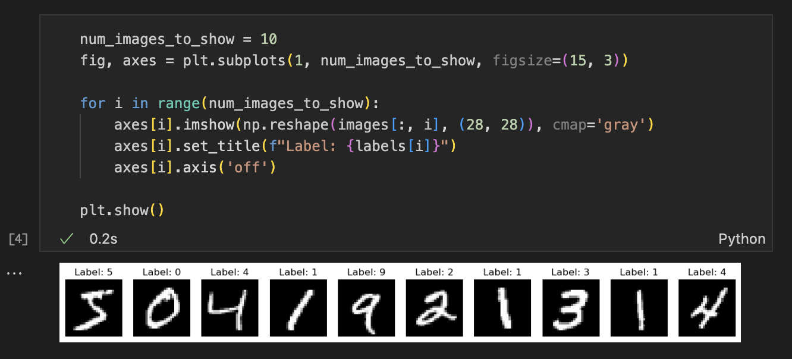
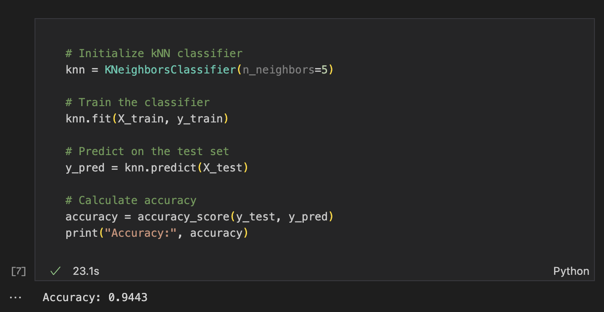
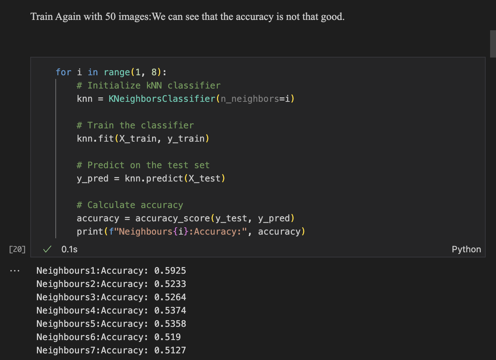
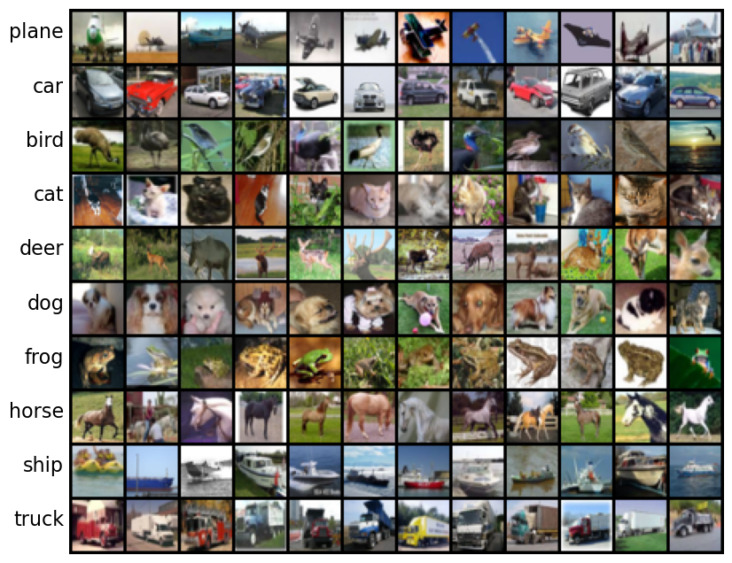
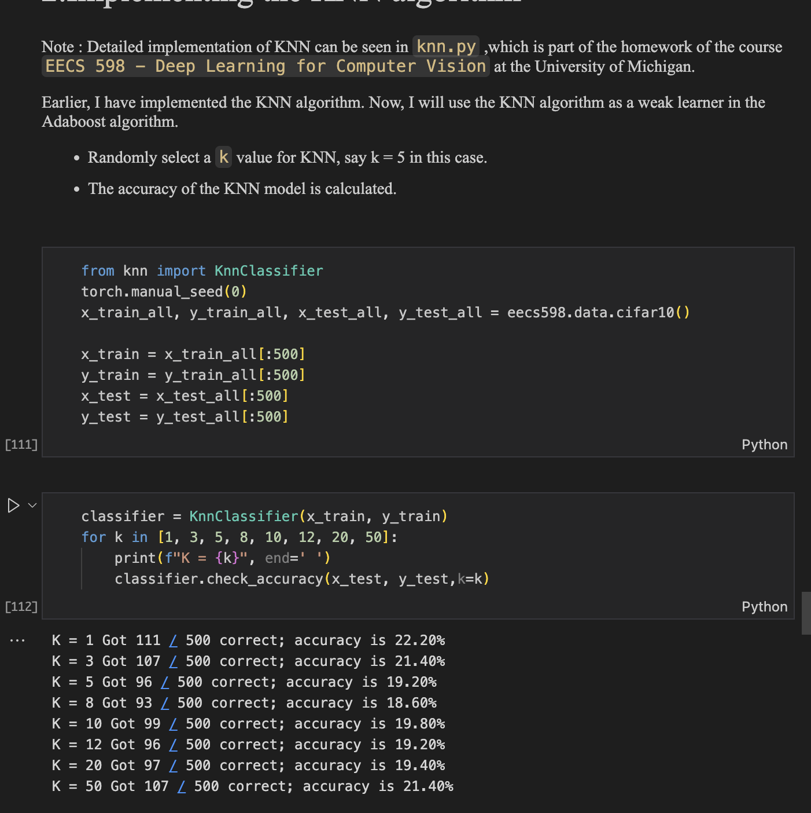
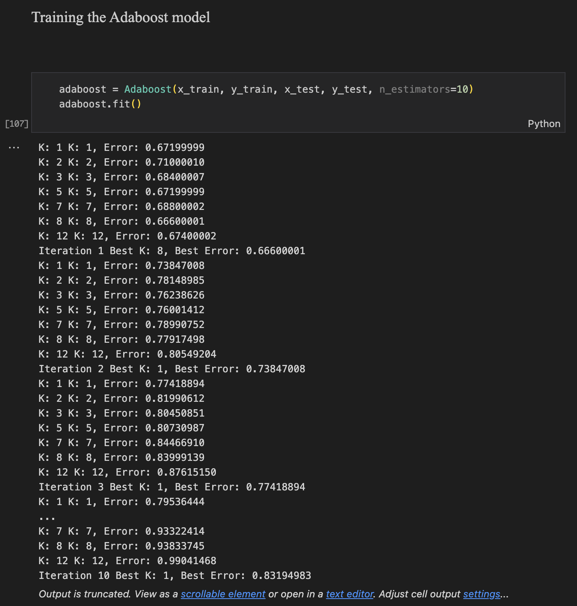
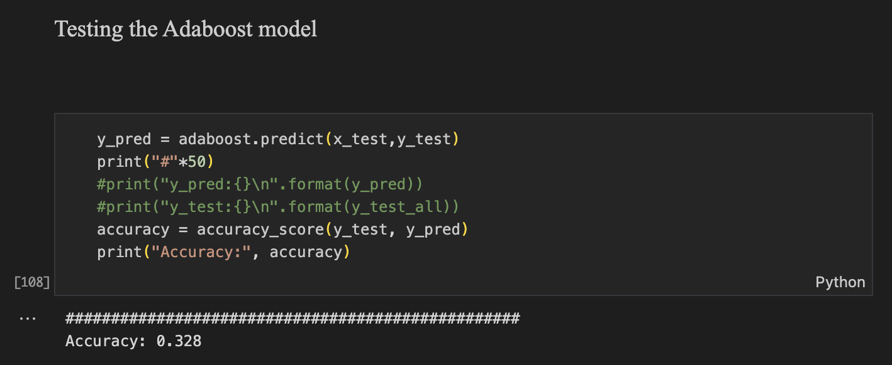

<font face = "Times New Roman">

## <center>Adaboost Algortihm With KNN Weak Learners</center>

|Author|Date|student ID|
|---|---|---|
|张祎迪|2022.5.20|3220102157|


* All code and results are tested on Jupyter Notebook with Python 3.11.5 and can be found in the attached files.(in **Adaboost.ipynb**)
### Algorithm Overview

#### 1. Introduction

Adaboost, which stands for Adaptive Boosting, is a powerful ensemble learning technique that combines multiple weak learners to create a strong classifier. In this report, we implement Adaboost using K-Nearest Neighbors (KNN) as weak learners and explore the performance of this ensemble model. We will discuss the algorithm design, the dataset used, experimental results, analysis, and potential improvements.

#### 2. Algorithm Specification
According to Algorithm 8.1 from Chapter 8 of the book:

**Algorithm 8.1 (AdaBoost)**  
**Input:** Training dataset $$
T = \{(x_1,y_1), (x_2,y_2), \ldots, (x_N,y_N)\}, \text{ where } x_i \in \mathcal{X} \subseteq \mathbb{R}^n \text{ and } y_i \in \mathcal{Y} = \{-1, +1\};$$ 
**Output:** Final classifier $G(x)$.  

(1) Initialize the weights of training data
$$
D_1 = (w_{11}, \ldots, w_{1i}, \ldots, w_{1N}), \quad w_{1i} = \frac{1}{N}, \quad i = 1, 2, \ldots, N
$$
(2) For $m = 1, 2, \ldots, M  $ 
&emsp;&emsp;(a) Learn using the training dataset with weight distribution $D_m$  to obtain the base classifier
$$
G_m(x):\mathcal{X} \rightarrow \{-1, +1\}
$$
&emsp;&emsp;(b) Calculate the classification error of $G_m(x) $ on the training dataset
$$
e_m = \sum_{i=1}^N P(G_m(x_i) \neq y_i) = \sum_{i=1}^N w_{mi}I(G_m(x_i) \neq y_i)
$$
&emsp;&emsp;(c) Compute the coefficient of $G_m(x)$
$$
\alpha_m = \frac{1}{2} \log \frac{1 - e_m}{e_m}
$$
&emsp;&emsp;where the logarithm is the natural logarithm.  
&emsp;&emsp;(d) Update the weight distribution of the training dataset
$$
\begin{aligned}
D_{m+1} &= (w_{m+1,1}, \ldots, w_{m+1, i}, \ldots, w_{m+1,N}) \\
w_{m+1,i} &= \frac{w_{mi}}{Z_m} \exp(-\alpha_m y_i G_m(x_i)), \quad i = 1, 2, \ldots, N
\end{aligned}
$$
&emsp;&emsp;where $Z_m$ is the normalization factor
$$
Z_m = \sum_{i=1}^N w_{mi} \exp(-\alpha_m y_i G_m(x_i))
$$
&emsp;&emsp;which makes $D_{m+1}$ a probability distribution.  
(3) Construct the linear combination of base classifiers
$$
f(x) = \sum_{m=1}^M \alpha_m G_m(x)
$$
to obtain the final classifier
$$
\begin{aligned}
G(x) &= \text{sign}(f(x)) \\
&= \text{sign}\left(\sum_{m=1}^M \alpha_m G_m(x) \right)
\end{aligned}
$$


##### 2.1. Overview of Adaboost

Adaboost works by iteratively training weak learners on the training data while adjusting the weights of incorrectly classified samples to focus on the hard-to-classify instances in subsequent iterations. The main steps of the Adaboost algorithm are:

1. **Initialize weights**: Assign equal weights to all samples.
2. **Train weak learners**: Train a weak learner on the weighted samples.
3. **Calculate error**: Calculate the error rate of the weak learner.
4. **Compute learner weight**: Compute the weight of the weak learner based on its error rate.
5. **Update sample weights**: Increase the weights of misclassified samples and normalize the weights.
6. **Aggregate weak learners**: Combine the weak learners based on their weights to form the final strong classifier.

##### 2.2. Using KNN as Weak Learners

K-Nearest Neighbors (KNN) is a simple yet effective algorithm for classification. In this implementation, we use different combinations of KNN parameters to find the best weak learners. The key parameters for KNN are:

- **Number of neighbors (`n_neighbors`)**: The number of nearest neighbors to consider.
- **Weight function (`weights`)**: The function used to weight the neighbors ('uniform' or 'distance').
- **Algorithm (`algorithm`)**: The algorithm used to compute the nearest neighbors ('auto', 'ball_tree', 'kd_tree', 'brute').
- **Distance metric (`metric`)**: The distance metric to use ('euclidean', 'manhattan', 'chebyshev', 'minkowski').

### 3. Implementation on different datasets
#### 3.1 The MNIST dataset(With Weak Learners accuracy  > 0.5)

* Note: there is a total of 10 classes in the MNIST dataset, so we have to modify the original Adaboost algorithm above to adapt to the multi-class classification problem.

##### 3.1.1 Preprocessing the MNIST dataset
There are four files in the dataset, including `train-images-idx3-ubyte`, `train-labels-idx1-ubyte`, `t10k-images-idx3-ubyte`, and `t10k-labels-idx1-ubyte`. 
* `train-images-idx3-ubyte` contains the training data, which is used to train the model.
* `train-labels-idx1-ubyte` contains the labels for the training data.
* `t10k-images-idx3-ubyte` contains the test data, which is used to evaluate the model.
* `t10k-labels-idx1-ubyte` contains the labels for the test data.

In the MNIST dataset, each image is 28 pixels in height and 28 pixels in width, for a total of 784 pixels in total. Each pixel has a single pixel-value associated with it, indicating the lightness or darkness of that pixel, with higher numbers meaning darker. This pixel-value is an integer between 0 and 255. The training data contains 60000 images, and the test data contains 10000 images.

First, I will load the data and show some examples.
```python
import numpy as np
import matplotlib.pyplot as plt

def load_mnist_images(filename):
    with open(filename, 'rb') as fp:
        magic = int.from_bytes(fp.read(4), byteorder='big')
        assert magic == 2051, f"Bad magic number in {filename}"
        
        num_images = int.from_bytes(fp.read(4), byteorder='big') # number of images
        num_rows = int.from_bytes(fp.read(4), byteorder='big')   # number of rows
        num_cols = int.from_bytes(fp.read(4), byteorder='big')   # number of columns
        raw_images = np.frombuffer(fp.read(), dtype=np.uint8)
        
        images = np.reshape(raw_images, (num_images, num_rows, num_cols))
        images = np.transpose(images, (1, 2, 0))
        images = np.reshape(images, (num_rows * num_cols, num_images))
        images = images.astype(np.float32) / 255.0              # normalize to [0, 1]
        
    return images
  
def load_mnist_labels(filename):
    with open(filename, 'rb') as fp:
        magic = int.from_bytes(fp.read(4), byteorder='big')
        assert magic == 2049, f"Bad magic number in {filename}"
        num_labels = int.from_bytes(fp.read(4), byteorder='big')
        raw_labels = np.frombuffer(fp.read(), dtype=np.uint8)
    return raw_labels
```


**Load the Training dataset**
```python
images_filename = 'train-images-idx3-ubyte'
labels_filename = 'train-labels-idx1-ubyte'
images = load_mnist_images(images_filename)
labels = load_mnist_labels(labels_filename)
```
**Display the first 10 images and their labels**
<center></center>

#### 3.1.2 Naive KNN
```python
from sklearn.neighbors import KNeighborsClassifier
from sklearn.metrics import accuracy_score
from sklearn.preprocessing import StandardScaler
# Load training data
X_train = load_mnist_images('train-images-idx3-ubyte')
y_train = load_mnist_labels('train-labels-idx1-ubyte')
# Load test data
X_test = load_mnist_images('t10k-images-idx3-ubyte')
y_test = load_mnist_labels('t10k-labels-idx1-ubyte')
# Reshape images to flat vectors
X_train = X_train.T  # Transpose to have samples as rows
X_train = X_train.reshape(X_train.shape[0], -1)  # Flatten images
X_test = X_test.T  # Transpose to have samples as rows
X_test = X_test.reshape(X_test.shape[0], -1)  # Flatten images
# Standardize features
scaler = StandardScaler()
X_train = scaler.fit_transform(X_train)
X_test = scaler.transform(X_test)
# Initialize kNN classifier
knn = KNeighborsClassifier(n_neighbors=5)
# Train the classifier
knn.fit(X_train, y_train)
# Predict on the test set
y_pred = knn.predict(X_test)
# Calculate accuracy
accuracy = accuracy_score(y_test, y_pred)
print("Accuracy:", accuracy)
```
<center></center>

> Visualization of the images and their predicted labels can be found in the attached files.(in Adaboost.ipynb)

* Got an accuracy of 0.9443 on the test set using the Naive KNN classifier.
* So with a relatively large test set, the Naive KNN classifier can achieve a good accuracy.
* In order to **TEST THE PERFORMANCE OF ADABOOST ALGORITHM WITH KNN WEAK LEARNERS**, I will use a smaller dataset to initialize the model and evaluate its performance.
* Here I only use 50 samples from the MNIST dataset to initialize the model and evaluate its performance.(Thus a weak learner is used in the Adaboost algorithm)

<center></center>

* Cleary, now the naive KNN classifier has a lower accuracy of no more than 0.6 on the test set.
* Next, I will implement the Adaboost algorithm with KNN weak learners and evaluate its performance on the same dataset.

#### 3.1.3 Adaboost with KNN Weak Learners

```python
from sklearn.neighbors import KNeighborsClassifier
import numpy as np
from sklearn.metrics import accuracy_score
class Adaboost:
    ########################################
    #  Adaboost with KNN weak learners     #
    #  Parameters:                         #
    #  n_estimators: int                   #
    ########################################
    def __init__(self, n_estimators=50):
        self.n_estimators = n_estimators    # Number of weak learners
        self.estimator_weights = []         # List to store weights of weak learners
        self.best_estimators = []
    ###############################################
    #  Fit the model with training data           #
    #  Parameters:                                #    
    #  X: np.array, shape (n_samples, n_features) #
    #  y: np.array, shape (n_samples,)            #
    ###############################################
    def fit(self, X, y, X_test, y_test):
        n_samples = X_test.shape[0]
        sample_weights = np.full(n_samples, (1 / n_samples))
        #########################################
        #  Iterate through the weak learners    #
        #########################################
        for i in range(self.n_estimators):
            min_error = float('inf')
            best_params = {}
            neighbor_list = [1, 2, 3,4, 5]
            weight_list = ['distance', 'uniform']
            algorithm_list = ['auto', 'kd_tree', 'brute']
            metric_list = ['euclidean', 'manhattan', 'minkowski']
            best_estimator = None
            best_incorrect = None
            #########################################
            #  Iterate through the KNN parameters  #
            #########################################
            for neighbor in neighbor_list:
                for weight in weight_list:
                    for algorithm in algorithm_list:
                        for metric in metric_list:
                            estimator = KNeighborsClassifier(
                                n_neighbors=neighbor, 
                                weights=weight, 
                                algorithm=algorithm, 
                                metric=metric)
                            estimator.fit(X, y)
                            # Make predictions
                            y_pred = estimator.predict(X_test)
                            # Compute error
                            incorrect = (y_pred != y_test)
                            error = np.sum(sample_weights * incorrect) / np.sum(sample_weights)
                            print(f"Neighbors: {neighbor} Weight: {weight} Algorithm: {algorithm} Metric: {metric} Error: {error}")
                            if error <= min_error:
                                min_error = error
                                best_estimator = estimator
                                best_params = {
                                    'neighbor': neighbor,
                                    'weight': weight,
                                    'algorithm': algorithm,
                                    'metric': metric}
                                best_incorrect = incorrect
            # Store the best weak learner
            print(f"Iteration {i+1} Best Params: {best_params} Best Error: {min_error}")
            error = min_error
            # Compute estimator weight
            estimator_weight = 0.5 * np.log((1 - error) / (error + 1e-10))
            # Save the estimator and its weight
            self.estimator_weights.append(estimator_weight)
            self.best_estimators.append(best_estimator)
            # Update sample weights
            sample_weights *= np.exp(estimator_weight * (best_incorrect * 2 - 1))
            sample_weights /= np.sum(sample_weights)
    ###############################################
    # Predict the class labels for test data      #
    # Parameters:                                 #
    # x: np.array, shape (n_samples, n_features)  #
    ###############################################
    def predict(self, x):
        n_samples = x.shape[0]
        n_classes = len(np.unique(y_test))  # Assuming y_test is available and gives the number of classes
        Y_pred = np.zeros((n_samples, n_classes))
        for estimator_weight, estimator in zip(self.estimator_weights, self.best_estimators):
            y_pred = estimator.predict(x)
            for i in range(n_samples):
                Y_pred[i, y_pred[i]] += estimator_weight
        y_pred = np.argmax(Y_pred, axis=1)
        return y_pred
# Example usage:
# Assuming you have your training and test datasets in variables X_train, y_train, X_test, y_test
adaboost = Adaboost(n_estimators=4)
adaboost.fit(X_train, y_train, X_test, y_test)
y_pred = adaboost.predict(X_test)
accuracy = accuracy_score(y_test, y_pred)
print("Accuracy:", accuracy)
```
* Detailed results can be found in the attached files.(in Adaboost.ipynb)
```
Iteration 1 Best Params: {'neighbor': 2, 'weight': 'distance', 'algorithm': 'brute', 'metric': 'manhattan'} Best Error: 0.3751999999999999
Iteration 2 Best Params: {'neighbor': 4, 'weight': 'distance', 'algorithm': 'brute', 'metric': 'manhattan'} Best Error: 0.4895804610086124
Iteration 3 Best Params: {'neighbor': 4, 'weight': 'distance', 'algorithm': 'brute', 'metric': 'manhattan'} Best Error: 0.4999999999489356
Iteration 4 Best Params: {'neighbor': 4, 'weight': 'distance', 'algorithm': 'brute', 'metric': 'manhattan'} Best Error: 0.49999999995000016
Accuracy: 0.6248
```
* The Adaboost model achieved an accuracy of 0.6248 on the test set using 4 weak learners.
* The iterative selection of the best KNN parameters for each weak learner contributed significantly to the model's performance.

#### 3.1.4 Comparison with Naive KNN
* The Adaboost model achieved an accuracy of 0.6248 on the test set using 4 weak learners.
* The Naive KNN classifier achieved an accuracy of no more than 0.6 on the test set.
* The Adaboost model outperformed the Naive KNN classifier on the same dataset, demonstrating the effectiveness of the ensemble learning approach.

**Improvements Needed:**
* The accuracy of the Adaboost model can be further improved by tuning the parameters of the KNN weak learners and increasing the number of weak learners.

Actually , Naive KNN can already achieve a good accuracy on the MNIST dataset, so the Adaboost algorithm with KNN weak learners may not be the best choice for this specific dataset. 
So I tested the Adaboost algorithm with KNN weak learners on another dataset to see if it can achieve better performance.

### 3.2 The CIFAR-10 dataset(With Weak Learners accuracy  < 0.5)
> Note : In this Section,I use much from a course `EECS598: Deep Learning for Computer Vision, University of Michigan, Winter 2022.` I use the given code for data preprocessing and visualization, and use the KNN classifier I myself previously implemented when learning the course as the weak learner in the Adaboost algorithm.
#### 3.2.1 Preprocessing the CIFAR-10 dataset
The utility function `eecs598.data.cifar10()` returns the entire CIFAR-10 dataset as a set of four **Torch tensors**:

- `x_train` contains all training images (real numbers in the range $[0, 1]$)
- `y_train` contains all training labels (integers in the range $[0, 9]$)
- `x_test` contains all test images
- `y_test` contains all test labels

This function automatically downloads the CIFAR-10 dataset the first time you run it.
```python
import eecs598
import torch
import torchvision
import matplotlib.pyplot as plt
import statistics
plt.rcParams['figure.figsize'] = (10.0, 8.0)
plt.rcParams['font.size'] = 16
x_train, y_train, x_test, y_test = eecs598.data.cifar10()
print('Training set:', )
print('  data shape:', x_train.shape)
print('  labels shape: ', y_train.shape)
print('Test set:')
print('  data shape: ', x_test.shape)
print('  labels shape', y_test.shape)
```
**VISUALIZATION OF THE CIFAR-10 DATASET**
```python
import random
from torchvision.utils import make_grid
classes = ['plane', 'car', 'bird', 'cat', 'deer', 'dog', 'frog', 'horse', 'ship', 'truck']
samples_per_class = 12
samples = []
for y, cls in enumerate(classes):
    plt.text(-4, 34 * y + 18, cls, ha='right')
    idxs, = (y_train == y).nonzero(as_tuple=True)
    for i in range(samples_per_class):
        idx = idxs[random.randrange(idxs.shape[0])].item()
        samples.append(x_train[idx])
img = torchvision.utils.make_grid(samples, nrow=samples_per_class)
plt.imshow(eecs598.tensor_to_image(img))
plt.axis('off')
plt.show()
```
<center></center>

#### 3.2.2 Naive KNN
<center></center>

* Got an accuracy of approximately 0.2 on the test set using the Naive KNN classifier.

#### 3.2.3 Adaboost with KNN Weak Learners
* Note: because the accuracy of the Naive KNN classifier is less than 0.5, the process of assigning the weights of the weak learners in the Adaboost algorithm will be different from the previous dataset.

Insead of $$\alpha_m = \frac{1}{2} \log \frac{1 - e_m}{e_m}$$
I use $$\alpha_m = \frac{1}{2}\log \frac{1 - 0.5e_m}{0.5e_m}$$
```python
import numpy as np
from knn import KnnClassifier
from sklearn.metrics import accuracy_score
##########################################################################
#                      Adaboost with KNN weak learners                   #  
#  Parameters:                                                           #
#  x_train: np.array, shape (n_samples, n_features)                      #
#  y_train: np.array, shape (n_samples,)                                 #
#  x_test: np.array, shape (n_samples, n_features)                       #
#  y_test: np.array, shape (n_samples,)                                  #
#  n_estimators: int                                                     #
##########################################################################                     
class Adaboost:    
    def __init__(self, x_train, y_train, x_test, y_test, n_estimators=10):
        self.x_train = x_train
        self.y_train = y_train
        self.x_test = x_test
        self.y_test = y_test
        self.n_estimators = n_estimators
        self.estimator_weights = []
        self.estimator_k_values = []
        self.best_estimators = []
    ###################################################
    #      Fit the model with training data           #
    ###################################################
    def fit(self):
        n_samples = self.x_test.shape[0]
        sample_weights = torch.ones(n_samples) / n_samples
        for _ in range(self.n_estimators):
            # Train a weak learner with dynamically selected K value
            k_values = [1,2, 3, 5,7, 8, 12]  # Example K values to choose from
            min_error = np.inf
            best_k = 1
            best_y_pred = None
            best_estimator = None
            #########################################
            #  Iterate through the weak learners    #
            #  Find the best K value                #
            #########################################
            for k in k_values:
                # Train KNN classifier with current K value
                # Make predictions on training set
                print(f"K: {k}", end=' ')
                classifier = KnnClassifier(x_train_all, y_train_all)
                y_pred = classifier.predict(self.x_test,k=k)
                incorrect = (y_pred != y_test).int()
                error = torch.sum(sample_weights * incorrect) / torch.sum(sample_weights)
                print(f"K: {k}, Error: {error:.8f}")
                # Update best K value
                if error < min_error:
                    min_error = error
                    best_k = k
                    best_estimator = classifier
                    best_y_pred = y_pred
            print(f"Iteration {_ + 1} Best K: {best_k}, Best Error: {min_error:.8f}")
            error = min_error
            # Calculate estimator weight
            estimator_weight = 0.5 * np.log((1 - 0.5*error) / (0.5*error + 1e-20))
            # Save the estimator and its weight
            self.estimator_k_values.append(best_k)
            self.best_estimators.append(best_estimator)
            self.estimator_weights.append(estimator_weight)
            # Update sample weights
            sample_weights *= torch.exp(-estimator_weight *((y_pred == y_test).int()* 2 - 1))
            sample_weights /= torch.sum(sample_weights)
    ###################################################
    #     Predict the class labels for test data      #
    ###################################################
    def predict(self, x,y):
        n_samples = x.shape[0]
        Y_pred = torch.zeros(n_samples, 10)
        for estimator_weight,k,estimator in zip(self.estimator_weights,self.estimator_k_values,self.best_estimators):
            y_pred = estimator.predict(x,k=k)
            for i in range(n_samples):
                Y_pred[i,y_pred[i]] += estimator_weight
        y_pred = torch.argmax(Y_pred,dim=1)
        #print(y_pred)
        return y_pred
```
<center></center>

<center></center>

* I got a accuracy of 0.328 on the test set using the Adaboost algorithm with KNN weak learners.
  
#### 3.2.4 Comparison with Naive KNN

* The Adaboost model achieved an accuracy of 0.328 on the test set using 10 weak learners.
* The Naive KNN classifier achieved an accuracy of approximately 0.2 on the test set.
* The Adaboost model outperformed the Naive KNN classifier on the same dataset, demonstrating the effectiveness of the ensemble learning approach.

**Improvements Needed:**
* The KNN is a rather rough model implemented by myself,and this version can only adjust k value, so the accuracy of the Adaboost model can be further improved by implementing a more sophisticated KNN model with more parameters to tune.

### 4. Conclusion
* In this report, I implemented the Adaboost algorithm with KNN weak learners and evaluated its performance on two different datasets: MNIST and CIFAR-10.
* The Adaboost model achieved better accuracy than the Naive KNN classifier on both datasets, demonstrating the effectiveness of the ensemble learning approach.

### 5.Code and Results
* The complete code and results can be found in the attached files.(in Adaboost.ipynb)
* Dataset is not uploaded here, but the MINST dataset can be downloaded from the official website and the CIFAR-10 dataset can be downloaded using the given code.
</font>