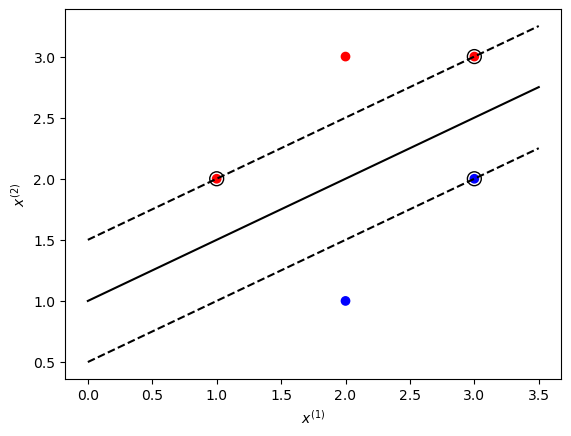

<font face="song">

### 7.1 : 比较感知机的对偶形式与线性可分支持向量机的对偶形式

**感知机的对偶形式**


> **算法2.2（感知机学习算法的对偶形式）**  
> 输入：线性可分的数据集$T=\{(x_1,y_1),(x_2,y_2),\cdots,(x_N,y_N)\}$，其中$x_i \in R^n, y_i \in \{-1, +1\}, i=1,2,\cdots,N$；学习率$\eta$（$0 < \eta \leqslant 1$）；
输出：$a,b$；感知机模型$\displaystyle f(x)=\text{sign} \left( \sum_{j=1}^N \alpha_j y_j x_j \cdot x + b \right)$，其中$\alpha = (\alpha_1, \alpha_2,\cdots, \alpha_N)^T$  
（1）$\alpha \leftarrow 0,b \leftarrow 0$；  
（2）在训练集中选取数据$(x_i, y_i)$；  
（3）如果$\displaystyle y_i\left( \sum_{j=1}^N \alpha_j y_j x_j \cdot x + b \right) \leqslant 0$，
> $$\alpha_i \leftarrow \alpha_i + \eta \\b \leftarrow b + \eta y_i$$  
>（4）转至（2），直至训练集中没有误分类数据。

对偶形式最终得到:
$$w=\sum_{i=1}^N \alpha_i y_i x_i\\ b=\sum_{i=1}^N \alpha_i y_i$$
这里，$\alpha_i \geqslant 0, i=1,2,\cdots,N$


**线性可分支持向量机的对偶形式**

> **算法7.2（线性可分支持向量机学习算法）**  
> 输入：线性可分训练集$T=\{(x_1,y_1),(x_2,y_2), \cdots, (x_N,y_N)\}$，其中$x_i \in \mathcal{X} = R^n$，$y_i \in \mathcal{Y} = \{-1, +1\}$，$i=1,2,\cdots, N$； 
> 输出：分离超平面和分类决策函数。  
>
> 1.构造并求解约束最优化问题
> $$\begin{array}{cl} \displaystyle \min_{\alpha} & \displaystyle \frac{1}{2} \sum_{i=1}^N \sum_{j=1}^N \alpha_i \alpha_j y_i y_j (x_i \cdot x_j) - \sum_{i=1}^N \alpha_i \text{s.t.} & \displaystyle \sum_{i=1}^N \alpha_i y_i = 0 \ \ \ \ \ \alpha_i \geqslant 0, \quad i=1,2,\cdots,N\end{array}$$
> 求得最优解$\alpha^*=(\alpha_1^*, \alpha_2^*, \cdots, \alpha_N^*)^T$ 
>
> 2.计算 $$w^* = \sum_{i=1}^N \alpha_i^* y_j x_i$$ 并选择$\alpha^*$的一个正分量$\alpha_j^* > 0$，计算 $$b^*=y_i-\sum_{i=1}^N \alpha_i^* y_i (x_i \cdot x_j)$$
>
> 3.求得分离超平面 $$w^* \cdot x + b^* = 0$$ 分类决策函数：$$f(x) = \text{sign}(w^* \cdot x + b^*)$$

核心思路是：构造并求解约束最优化问题

$$\begin{array}{cl} \displaystyle \min_{\alpha} & \displaystyle \frac{1}{2} \sum_{i=1}^N \sum_{j=1}^N \alpha_i \alpha_j y_i y_j (x_i \cdot x_j) - \sum_{i=1}^N \alpha_i \\\text{s.t.} & \displaystyle \sum_{i=1}^N \alpha_i y_i = 0 \\& \alpha_i \geqslant 0, \quad i=1,2,\cdots,N\end{array}$$
求得最优解$\alpha^*=(\alpha_1^*, \alpha_2^*, \cdots, \alpha_N^*)^T$​​

<div style="page-break-after: always;"></div>

**比较**
* 感知机的对偶形式是通过迭代的方式求解，而线性可分支持向量机的对偶形式是通过求解约束最优化问题得到的(支持向量机的对偶形式，通过拉格朗日函数，将原始问题转化为对偶问题，通过求解对偶问题得到最优解，而感知机的对偶形式是通过迭代的方式求解)
* 支持向量机得到的是最大间隔分离超平面，而感知机得到的是一个分离超平面

### 7.2 求最大间隔分离超平面和分类决策函数

已知正例点$x_1=(1,2)^T,x_2=(2,3)^T,x_3=(3,3)^T$，负例点$x_4=(2,1)^T,x_5=(3,2)^T$，试求最大间隔分离平面和分类决策函数，并在图中画出分离超平面、间隔边界及支持向量。  


1.对偶形式的约束最优化问题为：
$$
\begin{array}{cl}
\displaystyle \min_{\alpha} & \displaystyle \frac{1}{2} \sum_{i=1}^5 \sum_{j=1}^5 \alpha_i \alpha_j y_i y_j (x_i \cdot x_j) - \sum_{i=1}^5 \alpha_i \\
\text{s.t.} & \displaystyle \sum_{i=1}^N \alpha_i y_i = 0 \\
& \alpha_i \geqslant 0, \quad i=1,2,\cdots,N
\end{array}
$$

即为:
$$
\begin{array}{cl}
\begin{align*}
\displaystyle \min_{\alpha} & \displaystyle \frac{1}{2} (5\alpha_1^2 + 13\alpha_2^2 + 18\alpha_3^2+ 5\alpha_4^2 + 13\alpha_5^2 + 16\alpha_1\alpha_2 \\  &+ 18\alpha_1\alpha_3 -8\alpha_1\alpha_4 -14\alpha_1\alpha_5 + 30\alpha_2\alpha_3  -14\alpha_2\alpha_4 -24\alpha_2\alpha_5 -18\alpha_3\alpha_4 -30\alpha_3\alpha_5 + 16\alpha_4\alpha_5) - (\alpha_1 + \alpha_2 + \alpha_3 + \alpha_4 + \alpha_5) \\
\text{s.t.} & \displaystyle \alpha_1 + \alpha_2 - \alpha_3 - \alpha_4 - \alpha_5 = 0 \\
& \alpha_i \geqslant 0, \quad i=1,2,\cdots,5
\end{align*}
\end{array}
$$
求得 $\alpha^*=(1/2,0,2,0,5/2)$ 时，取得最小值，此时：
$$
w^* = \sum_{i=1}^5 \alpha_i^* y_i x_i = \left( \frac{1}{2} \cdot 1 \cdot \begin{pmatrix} 1 \\ 2 \end{pmatrix}  + 2 \cdot 1 \cdot \begin{pmatrix} 3 \\ 3 \end{pmatrix}  - \frac{5}{2} \cdot 1 \cdot \begin{pmatrix} 3 \\ 2 \end{pmatrix} \right) = \begin{pmatrix} -1\\ 2 \end{pmatrix}
$$
取$\alpha_3^* > 0$，计算：
$$
b^* = y_3 - \sum_{i=1}^5 \alpha_i^* y_i (x_i \cdot x_3) = 1 - \left( \frac{1}{2} \cdot 1 \cdot 9 + 2 \cdot 1 \cdot 18 - \frac{5}{2} \cdot 1 \cdot 15 \right) = -2
$$
最大间隔分离超平面为：
$$
-1 \cdot x^{(1)} + 2 \cdot x^{(2)} - 2 = 0
$$
分类决策函数为：
$$
f(x) = \text{sign}(-x^{(1)} + 2x^{(2)} - 2)
$$
图像见下（编程输出）

2.非对偶形式：
$$
\begin{array}{cl}
\displaystyle \min_{w,b} & \displaystyle \frac{1}{2} \|w\|^2 \\
\text{s.t.} & \displaystyle y_i(w \cdot x_i + b) \geqslant 1, \quad i=1,2,\cdots,5
\end{array}
$$
> 解相同，此处略

<div style="page-break-after: always;"></div>

**图像直接用编程输出**


```python
from sklearn.svm import SVC
import matplotlib.pyplot as plt
import numpy as np
X = [[1, 2], [2, 3], [3, 3], [2, 1], [3, 2]]
y = [1, 1, 1, -1, -1]

clf = SVC(kernel='linear', C=10000)
clf.fit(X, y)
w = clf.coef_[0]
b = clf.intercept_
vectors = []
for i in range(len(clf.support_vectors_)):
    vectors.append([clf.support_vectors_[i][0], clf.support_vectors_[i][1]])

print(f"w is {w}")
print(f"b is {b}")
print(f"support vectors are :{vectors}")

```

    w is [-1.  2.]
    b is [-2.]
    support vectors are :[[3.0, 2.0], [1.0, 2.0], [3.0, 3.0]]


然后进行图像绘制


```python
color_seq = ['red' if v==1 else 'blue' for v in y]
plt.scatter([i[0] for i in X], [i[1] for i in X], c=color_seq)

xaxis = np.linspace(0, 3.5)
a = -w[0] / w[1]
y_sep = a * xaxis - (clf.intercept_[0]) / w[1]
b = clf.support_vectors_[0]
yy_down = a * xaxis + (b[1] - a * b[0])
b = clf.support_vectors_[-1]
yy_up = a * xaxis + (b[1] - a * b[0])
plt.plot(xaxis, y_sep, 'k-')
plt.plot(xaxis, yy_down, 'k--')
plt.plot(xaxis, yy_up, 'k--')

# supporting vectors
plt.xlabel('$x^{(1)}$')
plt.ylabel('$x^{(2)}$')
plt.scatter(clf.support_vectors_[:, 0], clf.support_vectors_[:, 1], 
            s=100, facecolors='none', edgecolors='k')
plt.show()
```



    


**7.3**

线性支持向量机还可以定义为以下形式：
$$
\begin{array}{cl} 
\displaystyle \min \limits_{w,b,\xi} & \displaystyle \frac{1}{2} \|w\|^2 + C \sum_{i=1}^N \xi_i^2 \\
\text{s.t.} & y_i(w \cdot x_i + b) \geqslant 1 - \xi_i, \quad i=1,2,\cdots, N \\
& \xi_i \geqslant 0, \quad i=1,2,\cdots, N
\end{array}
$$
试求其对偶形式


**(1) 原始问题的拉格朗日函数**
$$
\begin{array}{cl} 
\displaystyle \min \limits_{w,b,\xi} & \displaystyle \frac{1}{2} \|w\|^2 + C \sum_{i=1}^N \xi_i^2 \\
\text{s.t.} & y_i(w \cdot x_i + b) \geqslant 1 - \xi_i, \quad i=1,2,\cdots, N \\
& \xi_i \geqslant 0, \quad i=1,2,\cdots, N
\end{array}
$$

可得
$$
\left \{ \begin{array}{ll}
\displaystyle f(x) = \frac{1}{2} \|w\|^2 + C \sum_{i=1}^N \xi_i^2 \\
c_i^{(1)}(x) = 1 - \xi_i - y_i(w \cdot x_i + b), \quad i = 1,2,\cdots, N \\
c_i^{(2)}(x) = - \xi_i, \quad i = 1,2,\cdots, N 
\end{array} \right.
$$

根据拉格朗日函数的定义，可得原始问题的拉格朗日函数为
$$
L(w,b,\xi, \alpha, \mu) = \frac{1}{2} \|w\|^2 + C \sum_{i=1}^N \xi_i^2 - \sum_{i=1}^N \alpha_i(y_i (w \cdot x_i + b)-1 + \xi_i) - \sum_{i=1}^N \mu_i \xi_i
$$
其中，$\alpha_i \geqslant 0, \mu_i \geqslant 0$​

即为
$$
\begin{array}{cl} 
\displaystyle \min \limits_{w,b,\xi} \max\limits_{\alpha_i,\mu_i}L(w,b,\xi, \alpha, \mu) 
\end{array}
$$


**(2)对偶形式**
$$
\begin{array}{cl} 
\displaystyle \max\limits_{\alpha_i,\mu_i} \min \limits_{w,b,\xi}L(w,b,\xi, \alpha, \mu) 
\end{array}
$$
**求解**

**1.求$\min \limits_{w,b,\xi}L(w,b,\xi, \alpha, \mu)$**

分别对$w,b,\xi$求偏导，并令导数等于0，由
$$
\begin{array}{l}
\displaystyle \nabla_w L(w,b,\xi,\alpha,\mu)  = w - \sum_{i=1}^N \alpha_i y_i x_i = 0 \\ 
\displaystyle \nabla_b L(w,b,\xi,\alpha,\mu)  =  -\sum_{i=1}^N \alpha_i y_i = 0 \\
\displaystyle \nabla_{\xi_i} L(w,b,\xi,\alpha,\mu)  = 2C \xi_i - \alpha_i - \mu_i = 0 
\end{array}
$$

可得：
$$
\begin{array}{l}
\displaystyle w = \sum_{i=1}^N \alpha_i y_i x_i \\ 
\displaystyle \sum_{i=1}^N \alpha_i y_i = 0 \\
\displaystyle 2C \xi_i - \alpha_i - \mu_i = 0 
\end{array}
$$

将上式代入到原始问题的拉格朗日函数中，可得
$$
\begin{aligned}
L(w, b, \xi, \alpha, \mu) 
&= \frac{1}{2} \sum_{i=1}^N \sum_{j=1}^N \alpha_i \alpha_j y_i y_j (x_i \cdot x_j) +  C \sum_{i=1}^N \xi_i^2 - \sum_{i=1}^N \alpha_i y_i \left( \left( \sum_{j=1}^N \alpha_j y_j x_j \right) \cdot x_i + b \right) \\
& + \sum_{i=1}^N \alpha_i - \sum_{i=1}^N \alpha_i \xi_i - \sum_{i=1}^N \mu_i \xi_i \\
&= -\frac{1}{2} \sum_{i=1}^N \sum_{j=1}^N \alpha_i \alpha_j y_i y_j (x_i \cdot x_j) + \sum_{i=1}^N \alpha_i + C \sum_{i=1}^N \xi_i^2 - \sum_{i=1}^N \alpha_i \xi_i - \sum_{i=1}^N \mu_i \xi_i \\
&= -\frac{1}{2} \sum_{i=1}^N \sum_{j=1}^N \alpha_i \alpha_j y_i y_j (x_i \cdot x_j) + \sum_{i=1}^N \alpha_i + C \sum_{i=1}^N \xi_i^2 - \sum_{i=1}^N (\alpha_i + \mu_i) \xi_i \\
&= -\frac{1}{2} \sum_{i=1}^N \sum_{j=1}^N \alpha_i \alpha_j y_i y_j (x_i \cdot x_j) + \sum_{i=1}^N \alpha_i + C \sum_{i=1}^N \xi_i^2 - 2C \sum_{i=1}^N \xi_i^2 \\
&= -\frac{1}{2} \sum_{i=1}^N \sum_{j=1}^N \alpha_i \alpha_j y_i y_j (x_i \cdot x_j) + \sum_{i=1}^N \alpha_i - C \sum_{i=1}^N \xi_i^2 \\
&= -\frac{1}{2} \sum_{i=1}^N \sum_{j=1}^N \alpha_i \alpha_j y_i y_j (x_i \cdot x_j) + \sum_{i=1}^N \alpha_i - C \sum_{i=1}^N \left(\frac{1}{4 C^2}(\alpha_i + \mu_i)^2 \right) \\
&= -\frac{1}{2} \sum_{i=1}^N \sum_{j=1}^N \alpha_i \alpha_j y_i y_j (x_i \cdot x_j) + \sum_{i=1}^N \alpha_i - \frac{1}{4 C}\sum_{i=1}^N (\alpha_i + \mu_i)^2
\end{aligned}
$$

**2.对$\displaystyle \min \limits_{w,b,\xi} L(w,b,\xi,\alpha,\mu)$求$\alpha,\mu$的极大**

&emsp;&emsp;根据第2步，对$\displaystyle \min \limits_{w,b,\xi} L(w,b,\xi,\alpha,\mu)$求$\alpha$的极大，可得到对偶问题：
$$
\begin{array}{cl} 
\displaystyle \max \limits_{\alpha,\mu} & \displaystyle -\frac{1}{2} \sum_{i=1}^N \sum_{j=1}^N \alpha_i \alpha_j y_i y_j (x_i \cdot x_j) + \sum_{i=1}^N \alpha_i - \frac{1}{4 C}\sum_{i=1}^N (\alpha_i + \mu_i)^2 \\
\text{s.t.} & \displaystyle \sum_{i=1}^N \alpha_i y_i = 0 \\
& \alpha_i \geqslant 0 ,\mu_i \geqslant 0, \quad i=1,2,\cdots, N
\end{array}
$$

**3.进行公式变换，得到对偶形式**

&emsp;&emsp;再将对目标函数求极大转换为求极小，于是得到原始问题的对偶形式
$$
\begin{array}{cl} 
\displaystyle \min \limits_{\alpha,\mu} & \displaystyle \frac{1}{2} \sum_{i=1}^N \sum_{j=1}^N \alpha_i \alpha_j y_i y_j (x_i \cdot x_j) - \sum_{i=1}^N \alpha_i + \frac{1}{4 C}\sum_{i=1}^N (\alpha_i + \mu_i)^2 \\
\text{s.t.} & \displaystyle \sum_{i=1}^N \alpha_i y_i = 0 \\
& \alpha_i \geqslant 0 ,\mu_i \geqslant 0,\quad i=1,2,\cdots, N
\end{array}
$$


</font>
