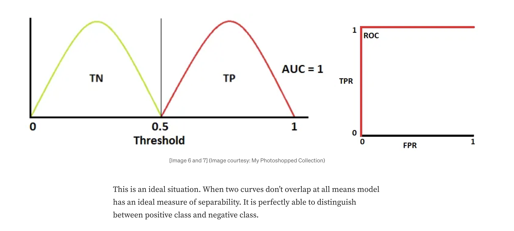
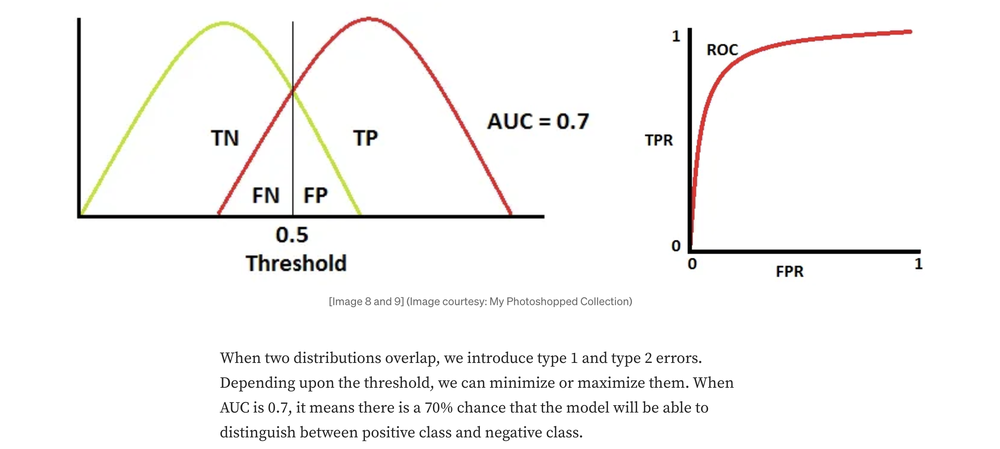
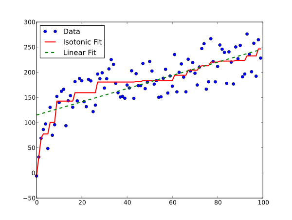
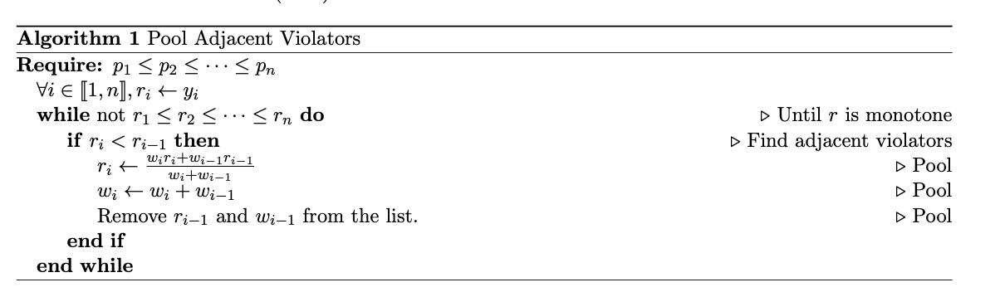
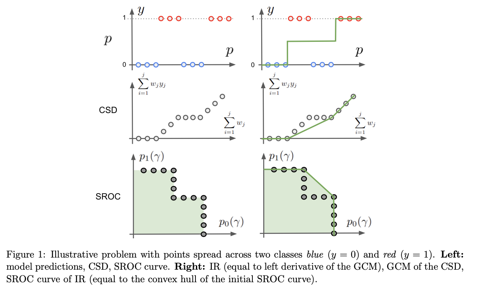
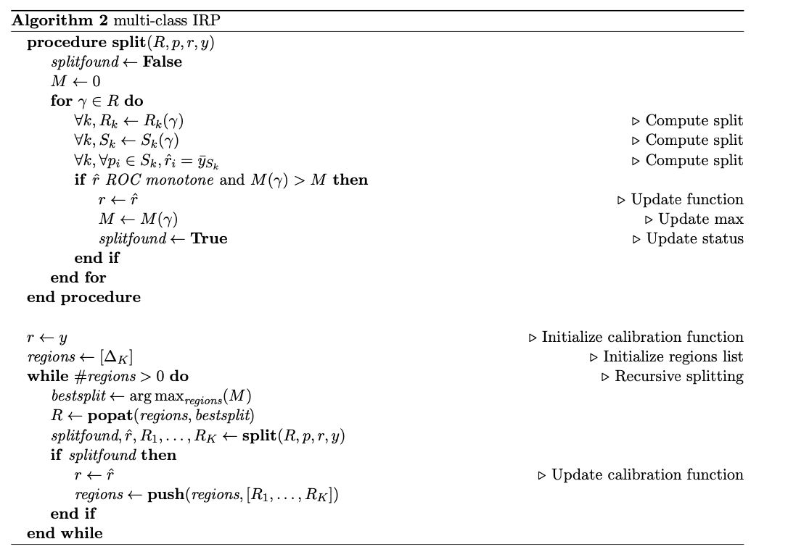

Classifier Calibration with ROC-Regularized Isotonic Regression

 

在通过机器学习完成分类任务的过程中，分类器的校准是很重要的，因为它可以提高分类器的可靠性和可解释性。这篇论文主要介绍了一种用于调整二元分类器的突出技术——**等渗回归(Isotonic Regression, IR)**

**现有问题的陈述：** 在机器学习分类任务中，模型的校准不仅能提高模型预测的可靠性和解释性，还能使得模型输出的概率更符合实际的观测频率。然而，现有的校准方法往往在追求低校准误差的同时，可能会导致模型过拟合校准集，影响模型的整体性能。

**本文贡献：** 本文提出了一种结合ROC曲线正则化的等渗回归方法（ROC-Regularized Isotonic Regression, RRIR），该方法在保证校准误差为零的同时，避免了校准过程中的过拟合问题。本文的主要贡献包括：

1. 证明了等渗回归在校准过程中保持ROC曲线凸包的特性。
2. 将等渗回归扩展到多分类问题，提出一种多维自适应分箱方法，保证多分类校准误差为零。
3. 通过引入单调性正则化，平衡了交叉熵损失的减少和校准集的过拟合。

## 一、介绍与背景

### 1.1 校准(Calibration)
通俗地讲，校准（Calibration）指的是分类器的输出概率与真实概率的一致性。具体来说，如果一个分类器输出某事件发生的概率为 p，那么在大量样本中，实际发生的频率应该接近 p。比如：对一个简单的二分类问题：某一天是否会下雨，如果一个分类器输出的概率是 $0.8$ ，那么这个概率应该是真实概率的估计值，即这一天下雨的真实概率也应该是 $0.8$.

$Defination 1.1:对一个分类器 f:\mathcal{X}\to \triangle_k,如果 E[Y|f(X)]=f(X),则称分类器f是校准的$

$Defination 1.2:对一个分类器 f:\mathcal{X}\to \triangle_k,校准误差为 \mathcal{K}(f)=E[|E[Y|f(X)]-f(X)|].(ECE:Expected Calibration Error)$

>**例子1：二元分类问题**
假设我们有一个二元分类问题，即预测某个学生是否通过了一门考试。我们的特征空间 $\mathcal{X}$ 包含了学生的学习时间、历年考试成绩等信息。现在我们的分类器 $f:\mathcal{X}\to \triangle_2$ 预测每个学生通过考试和不通过考试的概率。如果这个分类器是校准的，那么当它预测某个学生通过考试的概率为 $0.8$ 时，实际上有 $80\%$ 的概率这个学生真的通过了考试
然而，如果这个分类器不是校准的，比如它预测某两个学生通过考试的概率为 $0.8$ 时，而实际上预测的这两个学生通过考试的期望分别为 $0.6$ 和 $0.9$，那么这个分类器的校准误差为 $0.15$​.

>**例子2：多元分类问题** 
考虑一个多元分类问题，比如预测一封电子邮件属于哪个类别（垃圾邮件、工作邮件、个人邮件等）。我们的特征空间 $\mathcal{X}$ 包含了邮件的文本内容、发件人信息等。分类器 $f:\mathcal{X}\to \triangle_k$ 预测每封邮件属于各个类别的概率分布。如果这个分类器是校准的，那么当它预测某封邮件属于垃圾邮件，工作邮件和个人邮件的概率分别为 $0.3,0.5,0.2$ 时，实际上有 $30\%$ 的概率这封邮件是垃圾邮件，$50\%$ 的概率是工作邮件，$20\%$ 的概率是个人邮件

#### 离散预测的校准

如果分类器的输出是离散的(discrete grid),我们可以比较轻易地计算出校准误差：
$$
如果分类器的输出在离散网格 \mathcal{P}=[\lambda_1,\lambda_2,...\lambda_m]上，那么容易得到:\\
 E[y_i|f(x_i)]≃\frac{1}{\#S_j}\sum\limits_{k\in S_j}y_k,其中S_j=\{k\in [1,n]|f(x_k)=\lambda_j\}
$$
>例如，在天气预测中，我们通常将天气预测分为几个离散网格:$[0\%,10\%...,100\%]$

显然，校准曲线越接近对角线，分类器的校准性越好：即分类概率越接近真实概率
* 然而,在机器学习分类器的连续情况下，然而，这种离散化是否有意义并不明确；特别是，它们如何与性能相互作用也不清楚

#### 模型性能
通常，我们期待分类器的性能是好的，即分类器的校准误差越小越好;然而，这并不总是正确的，因为分类器的性能与校准误差之间存在`trade-off`
* 例如:当我们一个每隔一天一定会下雨的城市进行天气预报，如果我们分类器对于每一天都下雨的预测概率都是 $50\%$，那么这个分类器的校准误差为 $0$，但是这个分类器的性能是很差的。

**所以，我们需要平衡校准误差和分类器的表现性能**
#### 评分规则
任何合适的评分都可以分解为两个部分：校准误差和第二个细化项；将模型的置信度与概率对齐可以在无论模型的性能如何的情况下完成，模型的准确性越低，它在预测中的置信度就越低。
* 这证实了零校准误差并不一定保证好的预测。事实上，校准可以**独立于**分类器的性能而实现

机器学习分类器通常能够生成具有良好准确性的预测，但这些预测通常不是校准的，然而，校准分类器往往能够提供更好的表现和准确性，比如减小交叉熵损失等

### 1.2 机器学习分类器的校准

在机器学习中，我们通常会对数据集进行分割，一部分用于训练，另一部分用于校准

#### 问题
* 在 data-sparse的数据集上，这样的分割会出现问题
* 如果我们对训练出的模型进行更新，那么新加入的数据只能满足二者中的其一：要么用于训练，要么用于校准，这也就自然产生了`trade-off`
* 这样的数据集分割依赖于前提：训练集和校准集是同分布的，然而，这个前提在实际中并不总是成立的

#### 连续校准误差
由于在机器学习中，我们通常会得到一个连续的概率输出，如二分类问题中的 $[0,1]$，对此通常的处理是将概率输出进行分箱: $(B_j)_{1\le j\le m}=\{[0,\frac{1}{m}],...,[\frac{m-1}{m},1]\}$ ,离散化概率为 $\tilde{p}_j=b_j$ ,其中 $b_j$ 是 $bin$ $B_j$ 的中心

**问题**：
* 这种离散化在很多情况下是不合适的，比如预测的概率分布在$[0,1]$上是偏斜 $(skewed)$ 的.

#### 非参数模型校准

对于上述的离散化概率，我们可以通过将连续的概率离散化到相应分箱$B_j$ 的真实概率上，显然，这样的“映射”保证了模型的校准。
* 也就是说 $f(x)\to \tilde{p}_j$ ,其中 $\tilde{p}_j$ 是 $B_j$ 真实观测得到的概率

>**例子**
假设我们有一个二分类问题，我们的分类器输出了一组预测概率 $[0.2, 0.6, 0.8, 0.4, 0.9]$ ，我们将这些概率离散化到 $m=3$ 个区间中，即 $B_1=[0, \frac{1}{3}]$ ，$B_2=[\frac{1}{3}, \frac{2}{3}]$ ，$B_3=[\frac{2}{3}, 1]$ 。现在我们假设观测数据告诉我们，在每个区间中**数据的实际发生频率**分别是 $[0.1, 0.4, 0.7]$ 。那么我们可以使用非参数模型校准的方法将分类器的输出映射到真实的概率上，得到映射后的概率为 $[0.1, 0.4, 0.7, 0.4, 0.7]$ 这样，分类器的输出概率就与真实概率一致了，从而保证了模型的校准性能

同时，这样的方法明显是不合适的，而这也催生了**等渗回归**进行自适应分箱，贝叶斯分箱方案等

#### 参数模型校准

另一方面，出现了使用参数化程序纠正校准误差的丰富文献：
* 例如最小化与校准标签的交叉熵
* 在参数化方面的进一步发展包括贝塔校准方法

与分箱方法不同，这些方法学习**连续的**校准函数，但它们对校准**没有保证**

### 1.3 ROC 曲线和曲线下面积
#### ROC曲线
ROC曲线是一种用于评估二元分类器的性能的方法，它显示了真阳性率（TPR）和假阳性率（FPR）之间的权衡。ROC曲线是一个二维图，横轴是FPR，纵轴是TPR。ROC曲线越接近左上角，分类器的性能越好。
* TPR：真阳性率，即分类器正确识别正例的概率 $TPR=\frac{TP}{TP+FN}$
* FPR：假阳性率，即分类器错误识别负例的概率 $FPR=\frac{FP}{FP+TN}$
#### AUC:曲线下面积
$AUC$是$ROC$曲线下的面积，它是一个用于评估二元分类器性能的指标，$AUC$的取值范围在$[0,1]$之间，$AUC$越接近1，分类器的性能越好。

## 二、二分类的等渗回归

### 2.1 等渗回归

等渗回归（Isotonic Regression）是一种非参数方法，用于校准二元分类器的概率输出。它通过最小化校准误差，使得预测的概率输出与实际观察的概率一致
$$
\begin{align*}
&Defination 2.1:等渗回归:\\
&设n\in N^*_+，(p_i,y_i)_{1\le i\le n}\in (R^2)^n，(w_i)_{1\le i\le n}\in (R^+)^n为一组正权重,假设索引被选择，使得p_1\le p_2\le \cdots \le p_n\\
\\
&则等渗回归解决了下面的问题:min_{r\in R^n}\frac{1}{n}\sum_{i=1}^{n}w_i(y_i-r_i)^2使得r_1\le r_2\le \cdots \le r_n\\
&其中r可以被看作是一个n维向量或一个从P=\bold{R}到Y=\bold{R}的函数，其中r(p_i)=r_i
\end{align*}
$$

* 这是一个凸优化问题
* 等渗回归最小化任何Bregman损失函数，特别是KL散度:等渗回归最小化交叉熵损失

#### 邻近池算法（PAV）

可以通过著名的PAV算法来找到等渗回归（IR）问题的解
* 这个算法是一个非常简单的过程，具有$O(n)$的计算复杂度
  

  **算法1：邻近池算法**

  

1. **输入**：算法接收一个有序的样本集合 $(p_1, y_1), (p_2, y_2), ..., (p_n, y_n)$，其中 $p_i$ 是预测概率，$y_i$ 是对应的真实标签。同时，每个样本都有一个权重 $w_i$。

2. **初始化**：算法将每个样本的预测概率 $p_i$ 分配给对应的输出值 $r_i$，即 $r_i = y_i$。如果输入已经是单调递增（或递减）的，则跳过此步骤。

3. **迭代调整**：算法通过迭代调整来确保输出序列 $r_i$ 是单调递增的。具体地，在迭代过程中，算法会检查相邻的输出值 $r_i$ 和 $r_{i+1}$ 是否满足单调递增的条件。如果不满足，则通过调整 $r_i$ 和 $r_{i+1}$ 来满足条件。

4. **终止条件**：迭代直到输出序列 $r_i$ 是单调递增的为止。

### 2.2 等渗回归是校准的

在实践中，我们使用我们的分类器f在校准集上生成非校准预测$(p_i = f(x_i))_{1≤i≤n}$。然后，我们使用这些非校准预测作为输入，以及校准标签$(yi)_{1≤i≤n}$作为目标，以恒定的权重$∀i，w_i = 1$来拟合等渗回归。这给了我们一组新的校准预测$(r_i)_{1≤i≤n}$

* 从**算法1**中可以看出，$IR$产生了一个分段常数函数:
* 每个常数区域，函数的值是该区域内所有$p_i$的标签$y_i$的平均值

这两个简单的观察表明，IR产生了一个自适应的分箱方案，其中分箱边界设置为使得结果函数是递增的

**命题2.1**
一个维度的输入$(p_i)1≤i≤n$到二元标签$(y_i)1≤i≤n$的等渗回归$(r_i)1≤i≤n$实现了零校准误差，即$K(r, y) = 0$

**证明:**

在任何点p处的r的值可以写成：$r(p) = \frac{1}{\#\{p_i\in B_j\}} \sum yi,$  其中$B_j$是一组有限的箱$(B_j)1≤j≤m$中的某个箱，使得$p ∈ B_j$

此外，r是递增的，仅取$m$个不同的值$[b_1,...,b_m]$。对于任何p ∈ R，事件$\{p ∈ B_j\}$和$\{r(p) = b_j\}$是等价的,因此:
$$
E[Y|r(p)=b_j]= \frac{1}{\# \{r(pi) = bj\}} \sum\limits_{r(pi)=bj}yi = \frac{1}{\# \{pi ∈ Bj\}} \sum\limits_{p_i\in B_j} yi\quad 
$$
因此，对于任何$p ∈ R$，$E[Y |r(p)] − r(p) = 0$，校准误差为零

### 2.3 等渗回归保持 ROC-AUC

**Tradeoff**:

通过等渗回归来校准分类器，我们可以提高分类器的校准性能，但是这可能会降低分类器的性能

更详细地说，我们可以通过减小每个分箱中的点数来增加分类器的准确性，但是会导致过拟合，也会导致校准性能的损失

**那么等渗回归是如果应对这种tradeoff的呢?**

**前提：**

* 校准函数是递增的，所以我们能够保证等渗回归保存了原有预测的趋势和质量
* 但是我们约束的是"$\le$而不是 "$<$"，所以原先的排序只是被部分保留

**定义2.2（对称ROC曲线）**
简单形式$∆_2$可以在R上缩减为$[0, 1]$区间。对于$[0, 1]$区间内的不同阈值$γ$，我们可以将简单形式分割为两个部分$R_0 = [0, γ]$和$R_1 = [γ, 1]$，并评估$p_0(γ) = P(X ∈ R_0|Y =0)$、$p_1(γ) = P(X ∈ R_1|Y =1)$

我们将**对称ROC曲线（SROC）**定义为二维图形$p_0(γ), p_1(γ)，γ ∈ R$

**定理2.1：等距回归的ROC曲线是初始分类器的ROC曲线的凸包**

**证明:**

等距回归找到了累积和图的最大凸次剩余量（GCM）的左导数（Robertson等人，1988，定理1.2.1）, 因此，等距回归具有一个凸CSD，该凸CSD是原始CSD的GCM.
> **累计和图**
> 累积和图（CSD）是一个二维图，其中横轴是累积概率，纵轴是累积概率中的正例概率$\{(\sum\limits_{i=1}^jw_i,\sum\limits_{i=1}^jw_iy_i),j\in[1,n]\}$

在累积概率方面，CSD可以解释为：
$$ \{(P(X \leq p_j), P(X \leq p_j \cap Y = 1)),j\in [1,n]\} $$
通过简单的轴的仿射变换，$a_1 = \frac{a_1-a_2}{P(Y=0)}$ 且 $a_2 = 1 - \frac{a_2}{P(Y=1)}$，我们可以识别$SROC$:
$$ \{( P(X \leq p_j|Y = 0), P(X \geq p_j|Y = 1) ),j\in[1,n]\}$$

## 三、多分类的等渗回归

### 3.1 多分类ROC曲线

对于多分类的问题，我们关注：类似二元分类，我们希望在多分类问题中保留原始未校准ROC曲线，所以首先需要对高维ROC曲线进行定义:

令$A_K = \{x \in \mathbb{R}^K | \sum_{k=1}^{K} x_k = 1\}$表示$R^K$中单位向量的仿射组合，令$\gamma \in A_K$表示多维阈值。类似于二元情况，我们可以将$\Delta_K$分割成$K$个区域$R_1, R_2, ..., R_K$，围绕$\gamma$定义$K$个概率$p_1(\gamma) = P(X \in R_1|Y = 1), ..., p_K(\gamma) = P(X \in R_K|Y = K)$

改变$\gamma$允许我们构建一个$K$维的ROC曲面

* 对于给定的$\gamma \in A_3$，下图说明了$\Delta_3$的自然对称分割

* 这种分割策略可以扩展到在任意维度K中围绕任意点$γ \in A_K$构建简单形式的分割：$$R_k = \{r \in \Delta_K | \text{argmax}_{\mathbb[1,K\mathbb]} (r-γ) = k\}, \text{ for all } k \in [1, K]$$

* 定义点的子集$S_k(p,γ)$，它属于给定分割$γ$的区域$R_k$：$S_k(p,γ) = \{p_i \in R_k(γ)\}$

**定义3.1（ROC曲面）:**

对于具有输出$Y \in \Delta_K$的随机实验，我们将预测$P \in \Delta_K$的ROC曲面定义为K维图形：
$$\{p_1(γ), p_2(γ), ..., p_K(γ),\forall \gamma\in A_K \}$$ 其中$p_k(γ) = \mathbb{P}(P \in R_k(γ)|Y = k),\forall k \in [1,k]$，而$R_k(γ)$​如上所定义

* 这个ROC曲面说明了我们的分类器在任何选择的多维阈值$γ$下，有多好地将$K$类别数据分离的能力
* ROC曲面下的体积$(VUS)$可以在任意维度中计算，以提供多类分类器性能的指标。

### 3.2 广义单调性
>定义一个新的单调性标准，旨在保持初始模型的ROC曲面,使校准后的预测的ROC曲面与未校准的预测p的ROC曲面相同
在二元情况下，每个可能的阈值$γ∈[0,1]$生成了点$S_0(r,γ)$和$S_1(r,γ)$之间的分割。函数是单调的事实保证了可以通过对未校准的预测进行另一种分割来找到相同的样本分区。也就是说，对于所有的$γ∈[0,1]$，存在$γ'∈[0,1]$，使得$(S_0(p,γ')，S_1(p,γ'))=(S_0(r,γ)，S_1(r,γ))$，其中$γ≠γ'$

**定义3.2 ROC单调性:**
设$p=(p_i)_{i\in[1,n]}$表示未校准的预测，$r=(r_i)_{i\in[1,n]}$表示通过我们的校准函数映射这些预测得到的图像 ; 如果对于所有的$γ∈A_K$，存在$γ'∈A_K$使得$S_k(r,γ)=S_k(p,γ')$，对于所有的$k\in[1,K]$，则我们的函数被称为$ROC$单调

### 3.3 递归分割算法
采用与标准IRP相同的分割策略，给定一个区域R，我们通过求解选择最佳分割点$γ∈R$来选择$$M_R(γ)=\max_{γ∈R}\sum_{k=1}^{K}\#S_k(γ)|\bar{y}_R−\bar{y}_{R_k(γ)}|$$,其中$\bar{y}_B$是落入箱B的样本的平均标签

## 四、实验结果与讨论

#### 实验结果

在本文中，作者通过一系列实验验证了ROC正则化等渗回归（ROC-Regularized Isotonic Regression）方法在校准分类器概率输出中的有效性。实验使用了多个标准数据集，并与现有的几种校准方法进行了对比，包括：

1. **等渗回归（Isotonic Regression, IR）**
2. **Platt缩放（Platt Scaling, PS）**
3. **Beta校准（Beta Calibration, BC）**

实验结果表明，ROC正则化等渗回归方法在减少校准误差和提高模型预测的可靠性方面均表现出显著优势。具体而言，ROC正则化等渗回归方法在所有测试数据集上都显著降低了校准误差，同时在对数损失和Brier得分上也表现出色。以下是对几个关键实验结果的总结：

- **校准误差（Calibration Error）**：ROC正则化等渗回归方法在所有数据集上均实现了最低的校准误差，这表明该方法能够更好地匹配预测概率与真实概率之间的关系。
- **对数损失（Log Loss）**和**Brier得分（Brier Score）**：ROC正则化等渗回归方法在这些指标上表现优异，说明其不仅改善了模型的校准性能，还提高了整体预测的准确性。
- **AUC（Area Under the ROC Curve）**：尽管ROC正则化等渗回归方法主要针对校准误差进行优化，但其在AUC上的表现也保持了较高水平，显示了良好的分类性能。

#### 结果分析

通过对实验结果的分析，我们可以得出以下几点主要结论：

1. **校准误差的显著降低**：
   ROC正则化等渗回归方法在所有测试数据集上均显著降低了校准误差。这说明该方法在校准过程中有效地避免了过拟合问题，确保了校准的可靠性和一致性。

2. **对数损失和Brier得分的改进**：
   ROC正则化等渗回归方法在对数损失和Brier得分上表现出色，说明其不仅能改善模型的校准性能，还能提高整体预测的准确性。这表明ROC正则化等渗回归方法在平衡校准误差和预测性能方面具有较强的能力。

3. **保持AUC性能**：
   虽然ROC正则化等渗回归方法的主要目标是减少校准误差，但其在AUC上的表现也保持了较高水平。这表明该方法在保证校准性能的同时，没有显著牺牲模型的分类能力。

#### 对比讨论

与传统校准方法相比，ROC正则化等渗回归方法具有以下显著优势：

- **理论保证**：ROC正则化等渗回归方法通过引入ROC正则化，从理论上保证了校准误差为零，同时避免了校准过程中的过拟合问题。这使得ROC正则化等渗回归方法在实际应用中具有更好的泛化能力。
- **多分类扩展性**：本文将等渗回归扩展到多分类问题，通过多维自适应分箱方法实现了多分类校准误差的零化。这使得ROC正则化等渗回归方法在处理复杂的多分类任务时也能保持良好的校准性能。
- **实验证据**：实验证据表明，ROC正则化等渗回归方法在各种数据集上均优于现有校准方法，尤其是在减少校准误差和提高模型预测可靠性方面表现突出。

#### 局限性与未来工作

尽管ROC正则化等渗回归方法在实验中表现出色，但仍存在一些局限性和改进空间：

- **计算复杂度**：当前ROC正则化等渗回归方法的计算复杂度较高，特别是在处理大规模数据集时，计算效率仍需进一步优化。
- **不均衡数据处理**：在某些不均衡数据集上，ROC正则化等渗回归方法的性能可能受限。未来的研究可以探索自适应权重调整策略，以提升该方法在不均衡数据上的表现。

